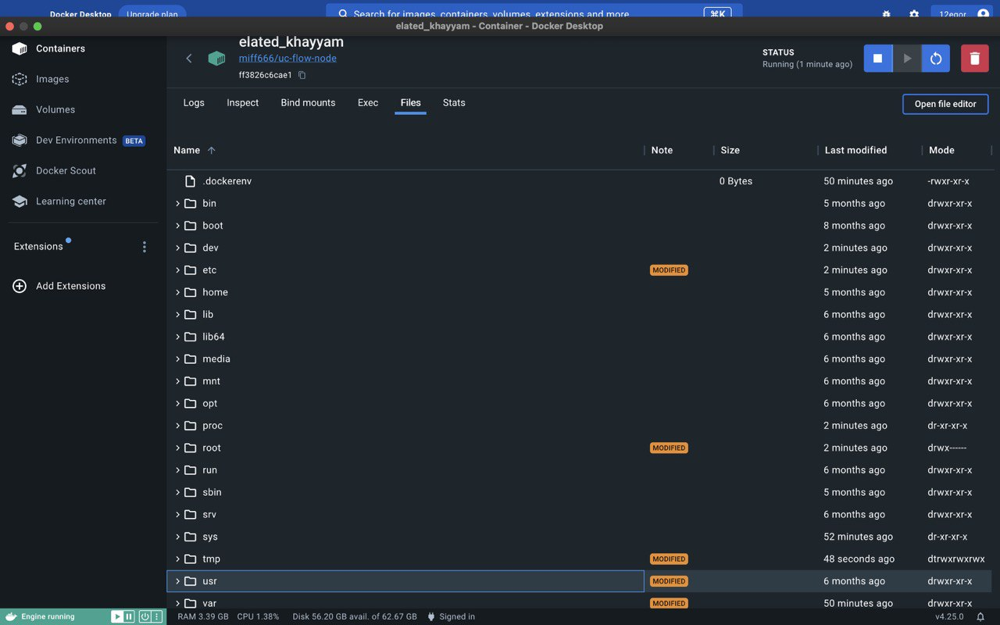
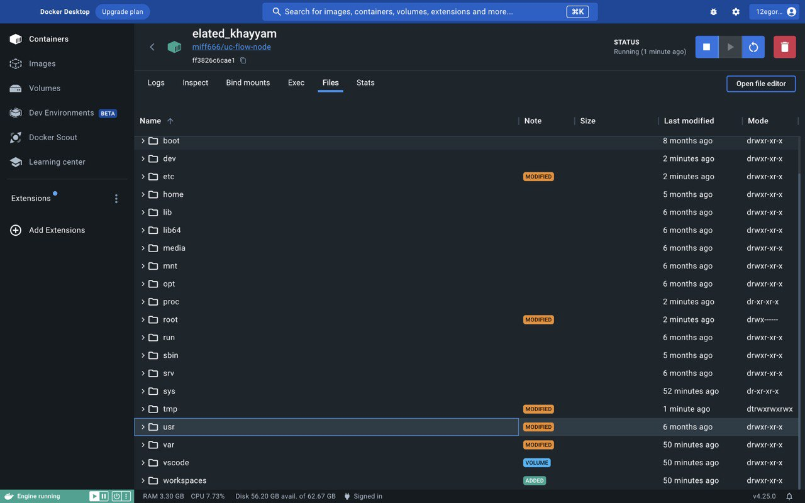
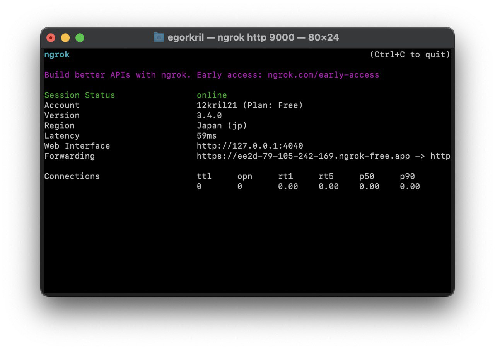

Нам потребуется:
 - Docker
 - VS Code
 - Ngrok
 - Git

1. Клонируйте данный репозиторий к себе на Git.
2. Скопируйте к себе на компьютер Вашу копию даного проекта. В ней мы будем работать.
3. В файле node/service.py и node/config.yaml измените с Example на необходимые названия.
4. Запустите данный проект в VS Code, чтобы в Docker создался образ и контейнер.
5. Найдите текущий проект и его файлы в запущеном контейнере Docker.
6. Сделайте скриншот файлов которые нашли внутри контейнера и добавьте в README.md
7. Запустите Ngrok htpp на порту 9000. Сделайте его скриншот и добавьте в README.md

Ответ:

